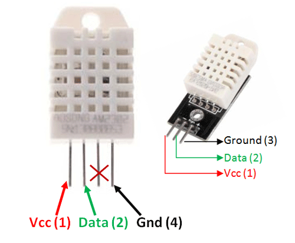

# [DHT22] Temperature and Humidity Sensor Controller
This project is a simple controller for a temperature and humidity sensor.

## Hardware
- DHT22 (aka: AM2302) Sensor
- Raspberry Pi Pico

### DHT22 Sensor Pinout

### Raspberry Pi Pico Pinout

### DHT22 Sensor Datasheet
[DHT22 Datasheet](.assets/DHT22.pdf)

### TempAndHumidityController Class
### Methods

#### `__init__(self, pin, temp_offset=0, humidity_offset=0)`
Initializes the `TempAndHumidityController` with the specified pin, temperature offset, and humidity offset.

- **Parameters:**
  - `pin` (int): The GPIO pin number to which the DHT22 sensor is connected.
  - `temp_offset` (float, optional): The temperature offset for calibration. Default is 0.
  - `humidity_offset` (float, optional): The humidity offset for calibration. Default is 0.

#### `measure(self)`
Measures the temperature and humidity using the DHT22 sensor.

- **Returns:**
  - `bool`: `True` if the measurement is successful, otherwise `False`.

#### `get_temperature(self)`
Gets the last measured temperature.

- **Returns:**
  - `float`: The last measured temperature, or `None` if no measurement is available.

#### `get_humidity(self)`
Gets the last measured humidity.

- **Returns:**
  - `float`: The last measured humidity, or `None` if no measurement is available.

#### `get_last_error_message(self)`
Gets the last error message.

- **Returns:**
  - `str`: The last error message, or an empty string if no error occurred.

#### `set_temp_calibration(self, offset)`
Sets the temperature calibration offset.

- **Parameters:**
  - `offset` (float): The temperature offset for calibration.

#### `set_humidity_calibration(self, offset)`
Sets the humidity calibration offset.

- **Parameters:**
  - `offset` (float): The humidity offset for calibration.

#### `get_readings(self)`
Gets the current temperature and humidity readings.

- **Returns:**
  - `dict`: A dictionary containing the temperature and humidity readings, or `None` if the measurement fails.

#### `continuous_measurement(self, max_consecutive_failures=10, delay_ms=1000)`
Continuously measures the temperature and humidity, yielding the results.

- **Parameters:**
  - `max_consecutive_failures` (int, optional): The maximum number of consecutive failures allowed before raising an error. Default is 10.
  - `delay_ms` (int, optional): The delay in milliseconds between measurements. Default is 1000 ms.

- **Yields:**
  - `tuple`: A tuple containing a boolean indicating success, the temperature, the humidity, and the timestamp.

- **Raises:**
  - `Dht22Error`: If the maximum number of consecutive failures is reached.
